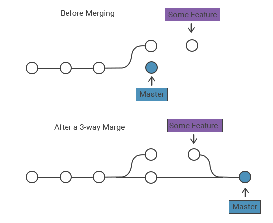
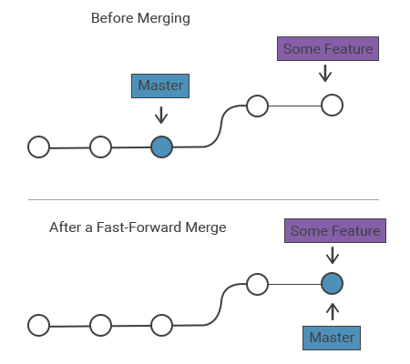

# Branch

## 정의
* 브랜치는 소프트웨어 개발에서 가장 많이 사용되는 개념 중 하나로, 독립적인 개발 흐름을 만들어, 병렬적으로
개발할 수 있도록 해준다.

## Branch 사용 이유
1. 새로운 기능 추가
2. 다른 개발자와의 협업

## 3 Way Merge

* 각자 다른 분기에서 하나의 분기로 합쳐질 때의 시나리오

## FastForword Merge

* 하나의 분기, 다른 브랜치 포인터였을 경우의 시나리오

