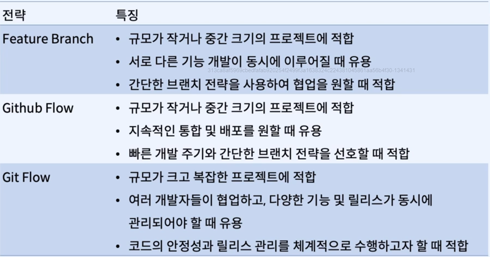

# Branch

## 정의
* 브랜치는 소프트웨어 개발에서 가장 많이 사용되는 개념 중 하나로, 독립적인 개발 흐름을 만들어, 병렬적으로
개발할 수 있도록 해준다.

## Branch 사용 이유
1. 새로운 기능 추가
2. 다른 개발자와의 협업

## 3 Way Merge

* 각자 다른 분기에서 하나의 분기로 합쳐질 때의 시나리오

## FastForword Merge

* 하나의 분기, 다른 브랜치 포인터였을 경우의 시나리오

***

## Git Branch 전략
* 프로젝트의 Git 브랜치를 효과적으로 관리하기 위한 워크플로우

### 사용 이유
1. 코드의 안정성 유지 -> 안정적인 프로덕션 환경
2. 협업의 효율성 증대 -> 코드 충돌 최소화
3. 작업의 독립성 보장 -> 개발 속도 향상
4. 효과적인 코드 리뷰 -> 코드 품질 향상

### 장점
1. 코드 관리의 효율성
2. 작업의 독립성
3. 안정성 유지
4. 코드 리뷰 및 품질 관리
5. 배포 및 롤백의 용이성

## Feature Branch 전략
### 1. Feature Branch 생성
* 메인 브렌치에서 새로운 feature 브랜치 생성
* 브랜치 이름은 해당 기능을 설명하는 명칭 사용
* feature/기능명 의 형식을 따름

### 2. 작업 진행
* 새로운 feature 브랜치에서 작업을 진행하고 필요한 경우 여러 개의 커밋을 생성

### 3. 원격 저장소 Push
* 메인 브랜치로 병합하기 전에 원격 저장소에 feature Branch를 push

### 4. Merge
* 리뷰 후, feature 브랜치를 merge
* merge 이후 불필요한 feature 브랜치는 삭제

## GitHub Flow 전략
* 규모가 작거나 중간 크기의 프로젝트에 적합
* 빠른 개발 주기와 지속적인 배포에 초점

### 1. 브랜치 생성
* 기준 브랜치에서 새로운 브랜치 생성
* 브랜치 명은 작업 내용을 설명하는 명칭
* 기준 브랜치는 항상 배포 가능한 상태 유지

### 2. 작업 진행

### 3. Push

### 4. PR 생성
* Github에서 Pull Request를 생성하여 코드 리뷰를 요청
* 코드 리뷰 완료 후, 기준 브랜치로 병합하고 PR 종료

## **Git Flow**
### 프로젝트의 코드 관리와 릴리스를 체계적으로 진행하는 방법론

* Main(Master) : 프로덕션 환경에 배포되는 안정적인 코드가 저장되는 브랜치
* Develop : 개발 중인 코드를 관리하는 브랜치
* Feature : 새로운 기능 개발을 위한 브랜치(Develop 브랜치로부터 분기)
* Release : 새로운 버전 릴리스를 준비하는 브랜치(Develop 브랜치로부터 분기)
* Hotfix : 긴급한 버그 수정을 위한 브랜치(main 브랜치에서 분기)

### 1. 새로운 기능 개발
* Develop 브랜치에서 Feature 브랜치 생성
* 기능 개발 완료 후 Develop 브랜치로 Merge

### 2. 릴리스 준비
* Develop 브랜치에서 Release 브랜치 생성
* 버전 번호를 부여하고, 문서 작업 등 릴리스와 관련된 작업 진행
* 배포와 관련된 작업들은 Release에서 작업을 한다고 보면 됨

### 3. 릴리스 확정
* Release 브랜치를 main 브랜치로 머지
* 해당 커밋에 태그를 추가하여 릴리스 버전 명시
* 이후 Release 브랜치를 Develop 브랜치로 머지

### 4. 긴급한 버그 수정
* main 브랜치에서 발견한 버그는 Hotfix 브랜치를 생성해서 수정
* 수정 완료 후 main / develop 브랜치로 머지

## 전략 선택 기준
* 프로젝트 규모
* 개발 팀의 구성
* 개발 및 배포 주기
* 코드 안정성

