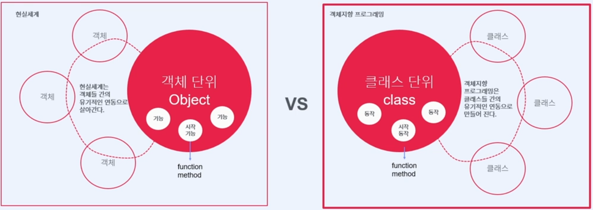

# 객체 지향 프로그래밍(Object-Oriented Programming, OOP)

## 객체지향 프로그래밍이란?
클래스 단위로 프로그래밍을 하는 것.

* Java 언어는 객체지향 언어이므로 객체(Object) 단위로 프로그래밍을 해야 한다. - 인간 중심 관점
* Java 언어는 객체지향 언어이므로 클래스(Class) 단위로 프로그래밍을 해야 한다. - 프로그래밍 관점

## 객체지향 설계 원칙(SOLID 원칙)
### 단일 책임 원칙
- 하나의 클래스는 하나의 책임만 져야 한다.
### 개방 폐쇄 원칙
- 확장에는 열려 있고, 변경에는 닫혀있어야 한다.
### 리스코프 치환 원칙
### 인터페이스 분리 원칙
### 의존관계 역전 원칙
